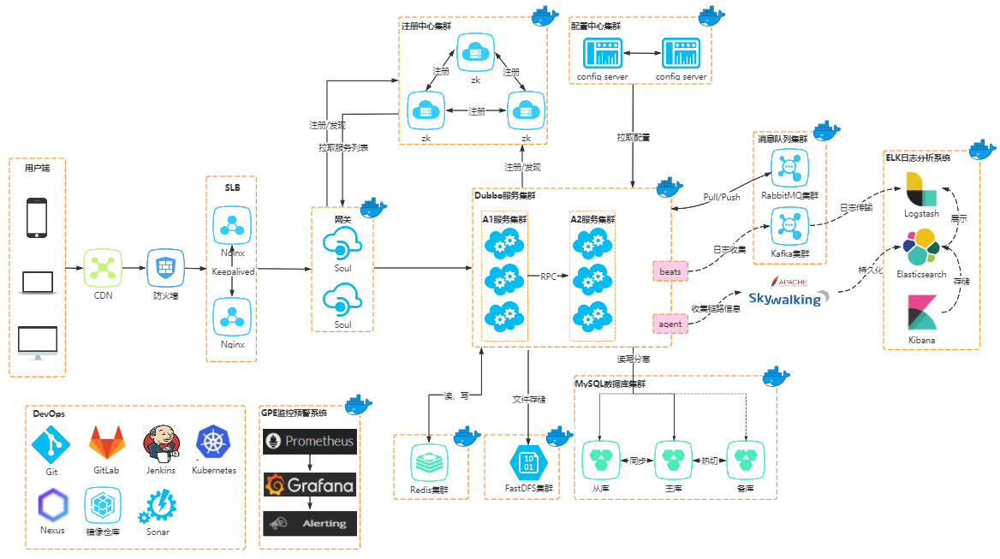

# FShop分布式/微服务秒杀系统

## 简介
FShop是一款基于Springboot+Mybatis+Dubbo+Zookeeper_RabbitMQ的分布式/微服务秒杀系统。FShop主要定位于高并发抢购业务系统
快速建设，提供下单、扣减库存、流量削峰、动静分离、热点隔离等核心问题解决方案。

### 技术栈

* 后端技术：SpringBoot + MyBatis + MySQL
* 前端技术：vue + jQuery + Thymeleaf
* 中间件技术：Redis + RabbitMQ + Zookeeper

## 系统架构

### 总体架构设计

### 技术架构设计

